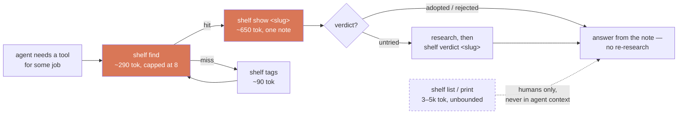

# shelf

**Your coding agent keeps recommending tools you already evaluated and rejected.**

You looked at that library six months ago and decided against it. You had good reasons.
Those reasons are gone — buried in a chat log, a closed tab, a starred repo you'll never
open again. So you research it from scratch, or worse, your agent does and reaches the
opposite conclusion.

`shelf` is a store for tools you might use on a *future* project, designed so an AI agent
can search it without eating your context window.

```bash
$ shelf find rate-limiting
bucketeer  [rejected]  https://github.com/someorg/bucketeer
    Token bucket limiter — dropped it, needs Redis and we're single-node
slowdown   [adopted]   https://github.com/someorg/slowdown
    In-process limiter, zero deps — shipped in the billing service
→ `shelf show <name>` for the full note
```

That's the whole idea. The verdict and the reasoning come back before you re-litigate the
decision.

## The context problem

A "just put it all in a markdown file" bookmark store breaks the moment an agent reads it.
At 100 items, the full set of notes is ~65,000 tokens — a third of a context window spent
on 99 things you didn't ask about.

So `shelf` splits its commands into a **bounded agent path** and **unbounded human views**,
and the agent instructions forbid the expensive ones. Measured at 100 items:

| Command | Cost | Grows with shelf size? | For |
| --- | --- | --- | --- |
| `shelf find <q>` | **~290 tok** | **no** — hard-capped at 8 hits | agents, always start here |
| `shelf tags` | ~90 tok | no — vocabulary only | recovering from a missed search |
| `shelf show <slug>` | ~650 tok | no — one note | after `find`, for the hit that matters |
| `shelf list` | ~3,000 tok | yes, linear | humans, in a terminal |
| `shelf print` | ~5,000 tok | yes, linear | humans, in a terminal |
| reading every note | ~65,000 tok | — | never |

**`find` → `show` costs ~940 tokens whether you have 10 items or 500.** That flatness is the
design, not a side effect.



## Install

One file, no dependencies, Python 3.8+:

```bash
curl -fsSL https://raw.githubusercontent.com/jhammant/shelf/main/shelf -o ~/.local/bin/shelf
chmod +x ~/.local/bin/shelf
shelf init
```

Or clone and symlink:

```bash
git clone https://github.com/jhammant/shelf.git
ln -s "$PWD/shelf/shelf" ~/.local/bin/shelf
shelf init
```

Data lives in `~/.shelf` by default — set `SHELF_DIR` to put it somewhere else (a dotfiles
repo, a synced folder, alongside your projects).

## Use

```bash
# shelve something, with the reason you cared
shelf add https://github.com/awslabs/aidlc-workflows \
  -w "structured agent workflow — governance + artifact trail" \
  -t agents,process -c          # -c also shallow-clones it

shelf edit aidlc-workflows      # fill in the note (see below)
shelf verdict aidlc-workflows rejected

shelf find agents               # ranked, capped
shelf tags                      # tag vocabulary + counts
shelf print                     # browsable, grouped by verdict
```

GitHub URLs are enriched automatically with stars, license and last-push date, so staleness
is visible later. `--offline` skips the lookup.

## Write the note, not just the link

A bare bookmark is worthless in six months. `shelf add` scaffolds four headings, and the
third is the one that earns its keep:

```markdown
## What it is
Mechanics, size, what actually runs it. Concrete, not marketing copy.

## When I'd reach for it
Name the specific project it would fit.

## Why not now
The honest blocker. This is what stops you re-litigating the decision next year.

## If I trial it
The exact setup — especially where it differs from the project's own README.
```

Verdicts move `untried → trialling → adopted / rejected`. **A `rejected` with reasoning is
the most valuable entry in the shelf**, and the one a starred-repos list can never give you.

## Wiring it to your agent

`skills/claude-code/` is a [Claude Code skill](https://docs.claude.com/en/docs/claude-code/skills)
that teaches the agent the retrieval path and the context budget — including the rule to
check the shelf *before* recommending anything new:

```bash
ln -s "$PWD/skills/claude-code" ~/.claude/skills/shelf
```

For Codex, Cursor, Copilot and friends, `AGENTS.md` carries the same rules in a portable
form — append it to your own.

The payoff isn't the storage. It's that "should I use X?" gets answered with *your own prior
verdict* instead of a fresh opinion.

## Design notes

- **Plain markdown, one file per item.** Greppable, diffable, git-friendly, readable without
  this tool. If `shelf` disappears your notes are still notes.
- **Ranked search**: name ×10 > tag ×6 > why ×4 > body ×1, so precision holds as the shelf
  grows instead of matching everything that says "python".
- **Clones are gitignored**, so `rg` skips them by default and a vendored 16MB repo can't
  pollute a search across your projects.
- **Colour only on a TTY** — piped or captured output spends no tokens on ANSI codes.
- **Stdlib only.** Network calls are best-effort; the shelf works offline.

## Tests

```bash
./tests/test_shelf.sh
```

36 end-to-end assertions against a throwaway `SHELF_DIR`, hermetic (no network).

## Licence

MIT — see [LICENSE](LICENSE).
