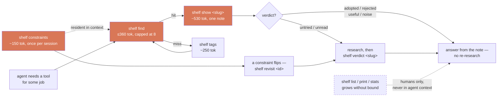

# shelf

[](https://github.com/jhammant/shelf/actions/workflows/test.yml)

**A virtual shelf for remembering the things you might need — and the things you looked at
and decided not to use.**

Your coding agent keeps recommending tools you already evaluated and rejected.

You looked at that library six months ago and decided against it. You had good reasons.
Those reasons are gone — buried in a chat log, a closed tab, a starred repo you'll never
open again. So you research it from scratch, or worse, your agent does and reaches the
opposite conclusion.

`shelf` is a store for tools you might use on a *future* project, designed so an AI agent
can search it without eating your context window.

```bash
$ shelf find rate-limiting
bucketeer  [rejected]  https://github.com/someorg/bucketeer
    Token bucket limiter — dropped it, needs Redis and we're single-node
slowdown  [adopted]  https://github.com/someorg/slowdown
    In-process limiter, zero deps — shipped in the billing service
→ `shelf show <name>` for the full note
```

That's the whole idea. The verdict and the reasoning come back before you re-litigate the
decision.

## The context problem

A "just put it all in a markdown file" bookmark store breaks the moment an agent reads it.
At 100 items the full set of notes is ~51,000 tokens — a quarter of a context window spent
on 99 things you didn't ask about. At 500 it's 254,000, and there is no context window that
saves you.

So `shelf` splits its commands into a **bounded agent path** and **unbounded human views**,
and the agent instructions forbid the expensive ones:

| Command | @10 | @100 | @500 | Bounded? | For |
| --- | --- | --- | --- | --- | --- |
| `shelf constraints` | 129 | 147 | 140 | **yes** — output is O(1) in shelf size | agents, **once per session** |
| `shelf find <q>` | 51 | 209 | **342** | **yes** — 8-hit cap | agents, always start here |
| `shelf revisit <id>` | 67 | 273 | 314 | yes — the same 8-hit cap | when a constraint changes |
| `shelf tags` | 131 | 251 | 251 | yes — tag vocabulary | recovering from a missed search |
| `shelf show <slug>` | 536 | 536 | 536 | yes — one note | after `find`, for the hit that matters |
| `shelf list` | 245 | 2,420 | 12,099 | no, linear | humans, in a terminal |
| `shelf print` | 462 | 3,793 | 18,538 | no, linear | humans, in a terminal |
| `shelf stats` | 283 | 273 | 275 | report capped at 8 rows/section; the computation is not | humans, in a terminal |
| reading every note | 5,059 | 50,840 | 254,138 | no, linear | never |

**`find` → `show` grows 1.5× between a 10-item shelf and a 500-item one — 587 to 878 tokens.
The shelf grew 50×, and so did reading everything.** The agent path has a ceiling; that's
the design, not a side effect. The cap is what buys it: past 8 matches `find` stops printing
and tells you to narrow the query.

Numbers are `o200k_base` tokens over a synthetic shelf whose notes match the length of real
filled-in ones (~2.5KB), mixed 80/20 tool/reading with eight constraints that the generated
verdicts cite — so the `find` row is measured on the hard case, not the easy one. `stats` is
measured against a 41-event usage log. Re-run it yourself with
[`bench/token_cost.py`](bench/token_cost.py).



## Install

One file, no dependencies, Python 3.8+:

```bash
curl -fsSL https://raw.githubusercontent.com/jhammant/shelf/main/shelf -o ~/.local/bin/shelf
chmod +x ~/.local/bin/shelf
shelf init
```

Or clone and symlink:

```bash
git clone https://github.com/jhammant/shelf.git
ln -s "$PWD/shelf/shelf" ~/.local/bin/shelf
shelf init
```

Data lives in `~/.shelf` by default — set `SHELF_DIR` to put it somewhere else (a dotfiles
repo, a synced folder, alongside your projects).

## Use

```bash
# shelve something, with the reason you cared
shelf add https://github.com/awslabs/aidlc-workflows \
  -w "structured agent workflow — governance + artifact trail" \
  -t agents,process -c          # -c also shallow-clones it

shelf edit aidlc-workflows      # fill in the note (see below)
shelf constraint single-node "no Redis, no Kafka — one box"   # a standing fact
shelf verdict aidlc-workflows rejected --because single-node  # the decision cites it

# reading gets its own scaffold and its own verdicts
shelf add https://arxiv.org/abs/1706.03762 -w "finally reading it properly" -t ml
shelf verdict 1706.03762 useful

shelf find agents               # ranked, capped
shelf tags                      # tag vocabulary + counts
shelf print                     # browsable, grouped by kind then verdict
```

GitHub URLs are enriched automatically with stars, license and last-push date, so staleness
is visible later. `--offline` skips the lookup.

## Two kinds, and why the verdicts don't overlap

Every item is a `tool` or a `reading` — inferred from the URL, overridable with `-k`, and
written into the note so a later change of heuristic can't silently reclassify it. Got it
wrong? `shelf kind <slug> reading` fixes it: it swaps the scaffold only while the body is
still the untouched template, and migrates the verdict only while it is still that kind's
default. Anything you actually wrote or decided is left alone — with a warning on the way
out if the verdict now belongs to the other vocabulary.

| Kind | Verdicts |
| --- | --- |
| `tool` | `untried` → `trialling` → `adopted` / `rejected` |
| `reading` | `unread` → `useful` / `noise` |

No word appears in both sets, and that is the whole design. `[useful]` in `find` output
already says "this is reading material and I got something from it", so the kind rides along
for **zero extra tokens** — no new column, no prefix, no glyph on the one command an agent
runs constantly. `noise` is the reading analogue of `rejected`: I read it and would not point
future-me at it again.

Reading gets its own four headings, and the third is again the one that earns its keep:
*What it argues* · *What I took from it* · **What I'd push back on** · *Where I'd apply it*.
A summary with no disagreement in it is indistinguishable from the article's own abstract.

`reading` means "consumed for ideas", not "text" — a conference talk is `reading`. Two kinds
is a deliberate ceiling, not a starting point.

## Constraints — the standing facts that decide things for you

The other half of bounded retrieval. Items are the big thing: searched, capped at 8.
Constraints are the small thing — bounded by your reality rather than your shelf size — so
they get the opposite treatment: **always loaded, never searched.**

```bash
$ shelf constraint single-node "no Redis, no Kafka — one box and no cluster ops"
$ shelf verdict bucketeer rejected --because single-node

$ shelf constraints             # once per session, keep it in context
single-node    ×4  no Redis, no Kafka — one box and no cluster ops
pg13           ×2  pinned to Postgres 13 until Q3
no-bsl         ×7  BSL/SSPL is out for anything we ship
3 live

$ shelf constraint single-node --lift    # we run Redis now
lifted `single-node` (2026-08-13) — 4 decisions rested on it:
bucketeer  [rejected]  https://github.com/someorg/bucketeer
    Token bucket limiter with a leaky-bucket fallback, dropped it because it wants a Redis instance we do not…
gatekeep  [rejected]  https://github.com/someorg/gatekeep
    Sliding-window limiter, same blocker and a heavier client library on top of it
sessionsvc  [rejected]  https://github.com/someorg/sessionsvc
    Session store that assumes a Redis cluster for failover
fanout  [untried]  https://github.com/someorg/fanout
    Pub/sub fan-out, parked until there is somewhere to put the broker
→ re-decide with `shelf verdict <slug> <verdict>`
```

The list comes back most-likely-to-change first — within a kind, `rejected` ahead of
`untried` ahead of `adopted` — and under the same 8-hit cap as `find`.
`shelf revisit single-node` asks the same question without changing anything. `--lift` is the honest exit: the fact stops being
true, the line stays with a `lifted` date, and every decision that rested on it comes back
for re-deciding. `--drop` is for a mistyped id and refuses while anything still cites it
(`--force` overrides, and `shelf constraints` then flags the orphaned citations on stderr).
Ids are lowercase, ≤24 characters, `[a-z0-9._-]`; the text is clipped to 80 characters on
display, so write the fact, not the essay.

Once the constraint set is resident, a note stops restating "needs Redis and we're
single-node" in prose — 7 tokens, in every note that hits the same wall — and emits a
4-token pointer instead. Restated across 12 rejections that is ~84 tokens of duplicated,
unsearchable text with 12 places to edit when it changes; cited, the fact costs **18 tokens
once**, and the pointer renders *inside* `find`'s existing 110-character why budget rather
than on a line of its own — so a cited page is the same 8 hits on the same two lines each
as an uncited one, with the same per-hit character ceiling.

That is a ceiling, not a free lunch. The ids only displace prose on a why already at the
110-character cap; on a shorter why they are an addition. Measured on two identical 20-item
shelves differing only in whether the verdicts cite `single-node` (o200k_base, 8 hits):
68-character whys cost **+24 tokens cited** (356 → 380, +3 per hit, same 18 lines);
124-character whys cost **−8** (412 → 404), because there the pointer really does displace
the prose. The band holds either way — the benchmark's `find` row at 500 items is measured
on cited data and comes in at 342 against the 360 ceiling.

`constraints.md` is one plain-markdown file, hand-editable, and committed. There is no
`constraints/` directory on purpose: a directory would invite per-constraint notes and
unbounded growth, which is the one property that must not exist in something loaded every
session. Past 12 live constraints `shelf constraints` warns on stderr.

## Is it earning its keep?

`find` and `show` append one line to `$SHELF_DIR/log.jsonl` as a silent side effect — mode
`0600`, gitignored, never networked. `shelf stats` turns that into the only question that
matters:

```bash
$ shelf stats
Shelf impact — 500 items · 170d since 2026-02-01

  searches         3,060   2,787 hit (91%) · 273 missed
  notes opened       429
  retrievals       3,489   3,429 piped (an agent, most likely) · 60 at a terminal (you)

  surfaced        adopted 5,381 · trialling 5,397 · untried 5,611 · rejected 5,907
  re-research        121   rejected notes opened · 5,907 rejected verdicts surfaced in results

most retrieved
  slowdown                    41  find 38 · show 3  adopted
  bucketeer                   40  find 31 · show 9  rejected

missed searches — gaps worth shelving
  kubernetes                  64

never retrieved — 300 of 500 items, shelved >30d and never surfaced
  bolt-292                  added 2025-10-01  caching,cli
  … 292 more — `shelf stats --dead`
```

The headline is **re-research avoided**, reported honestly as two numbers: rejected notes
actually *opened* (strong evidence) alongside rejected verdicts merely *surfaced* (weak).
A free `tty` flag splits agent retrievals from your own browsing.

`find`/`show` output is byte-identical with logging on and off — verified by diff — and the
append costs 0.037 ms. The log is hard-capped: at 256 KiB it folds itself into a rollup
record that preserves the lifetime counters exactly, so it oscillates between ~70 KiB and
256 KiB forever with no cron and no rotation policy. Naive truncation would have made
`stats` recommend pruning an item that was in daily use. The rollup's own maps are capped
too — top 40 missed queries, top 400 retrieved items — because a rollup that grew with the
shelf would itself blow past the trigger and leave every later `find` recompacting a log it
could no longer shrink. On a shelf big enough to hit that cap, an item retrieved once years
ago can drop back to `never retrieved`; anything in real use stays.

**Privacy**: the log is local, gitignored, `0600`, and contains your query text — so
`shelf stats --json` is not for pasting in public. The ignore pattern is `log.*`, not
`log.jsonl`, because compaction writes through a `log.tmp` holding the same verbatim
queries, and a rewrite killed halfway leaves it on disk. Three exits: `shelf stats --off`
(persistent, and purges the file), `SHELF_NO_LOG=1` per invocation, or just delete it. The
`.nolog` marker is deliberately *not* gitignored, so the preference travels with a synced
shelf while the log never does.

## Write the note, not just the link

A bare bookmark is worthless in six months. `shelf add` scaffolds four headings, and the
third is the one that earns its keep:

```markdown
## What it is
Mechanics, size, what actually runs it. Concrete, not marketing copy.

## When I'd reach for it
Name the specific project it would fit.

## Why not now
The honest blocker. This is what stops you re-litigating the decision next year.

## If I trial it
The exact setup — especially where it differs from the project's own README.
```

Verdicts move `untried → trialling → adopted / rejected` for a tool, and
`unread → useful / noise` for reading. **A `rejected` with reasoning is the most valuable
entry in the shelf**, and the one a starred-repos list can never give you.

## Wiring it to your agent

`skills/claude-code/` is a [Claude Code skill](https://docs.claude.com/en/docs/claude-code/skills)
that teaches the agent the retrieval path and the context budget — including the rule to
check the shelf *before* recommending anything new, to run `shelf constraints` once per
session and keep it, and never to run the unbounded human views:

```bash
ln -s "$PWD/skills/claude-code" ~/.claude/skills/shelf
```

For Codex, Cursor, Copilot and friends, `AGENTS.md` carries the same rules in a portable
form — append it to your own.

The payoff isn't the storage. It's that "should I use X?" gets answered with *your own prior
verdict* instead of a fresh opinion.

## Design notes

- **Plain markdown, one file per item.** Greppable, diffable, git-friendly, readable without
  this tool. If `shelf` disappears your notes are still notes.
- **Ranked search**: name ×10 > tag ×6 > why ×4 > body ×1, so precision holds as the shelf
  grows instead of matching everything that says "python".
- **Clones are gitignored**, so `rg` skips them by default and a vendored 16MB repo can't
  pollute a search across your projects.
- **Colour only on a TTY** — piped or captured output spends no tokens on ANSI codes.
- **Two bounded stores, opposite treatments.** Items grow without limit and are searched
  under a hard cap; constraints are bounded by your reality and are loaded whole, once.
- **Telemetry never breaks retrieval.** Every log write is wrapped and swallowed: a
  read-only shelf or a full disk costs you stats, never a search.
- **Stdlib only.** Network calls are best-effort; the shelf works offline.

## Tests

```bash
./tests/test_shelf.sh
```

260 end-to-end assertions against throwaway `SHELF_DIR`s, hermetic (no network). CI runs
them on Linux and macOS.

The cost table above is reproducible — it builds real shelves at three sizes and counts
tokens on every command path:

```bash
pip install tiktoken
./bench/token_cost.py
```

## Licence

MIT — see [LICENSE](LICENSE).
